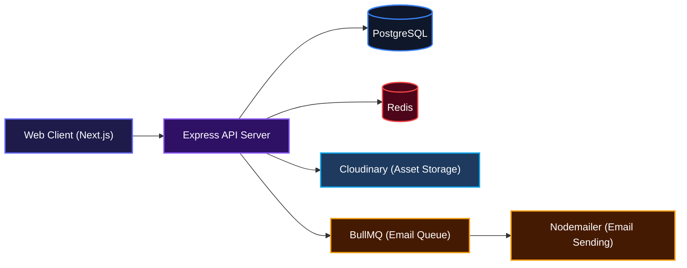
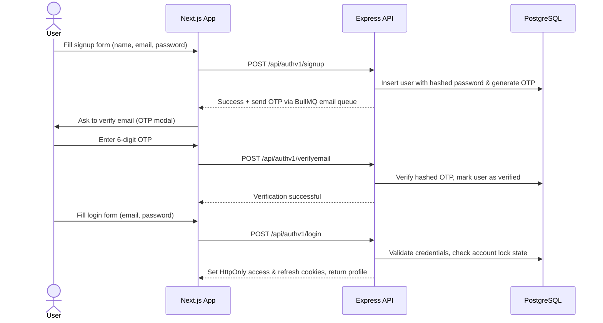
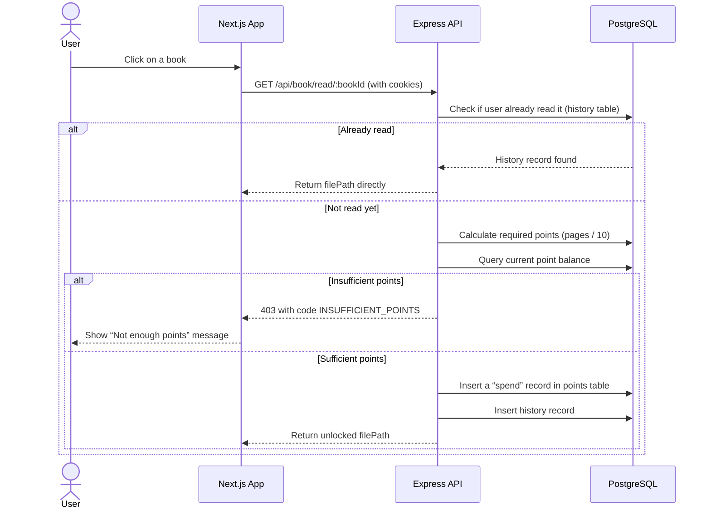
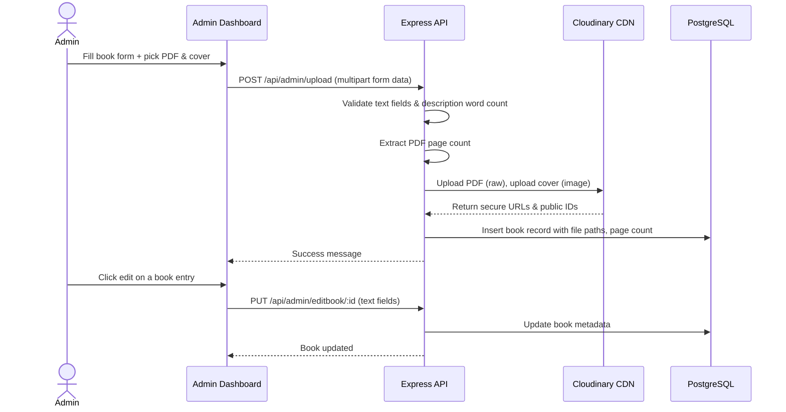

# ReadNest

A modern digital reading platform where users discover, unlock, and read books online using a point‑based access system.

## Overview

ReadNest is an online reading platform that makes it easy to explore, unlock, and read books directly in your browser. Users earn points and spend them to open books they’re interested in, while administrators can upload and manage an entire digital library. It’s designed from the ground up to feel fast, responsive, and intuitive — whether you’re browsing the latest releases, searching for a specific title, or diving into an administrative dashboard.

---

## System Architecture



---

## Features

### User Authentication & Security

Secure registration with email verification, login with automatic session refresh, forgot‑password flow, and account lockout after repeated failures. Sessions are managed via HTTP‑only JWT cookies.



### Points‑Based Book Unlocking

Every user receives a welcome bonus. Unlocking a book costs 1 point per 10 pages. Once unlocked, the page stays available. The platform keeps track of your reading history and point balance in real time.



### Admin Book Management

Admins can upload new books (PDF + cover image), edit metadata, replace the book file or cover, and delete entries. All uploads are stored securely in Cloudinary.



### Additional Capabilities

- **Discovery & Search** — Browse by category (Thriller, Horror, etc.), search by title or category, and view featured books.
- **Reading History** — Revisit any book you’ve unlocked; filtered by search if needed.
- **Points Deposit** — Users can top up their points (max 5000 per deposit) directly from the sidebar.
- **Dark / Light Mode** — Full theme support with a toggle.
- **Responsive Layout** — Works on desktops, tablets, and mobile devices.
- **Automated Emails** — OTP verification, password reset codes, and contact form submissions are delivered via BullMQ‑powered email workers.

---

## Technologies Used

| Category          | Technology                                                                                     |
|-------------------|------------------------------------------------------------------------------------------------|
| **Frontend**      | [Next.js](https://nextjs.org) (App Router), [React](https://react.dev) 19, [TypeScript](https://www.typescriptlang.org) |
| **Styling**       | [Tailwind CSS](https://tailwindcss.com) v4, [Framer Motion](https://www.framer.com/motion/)    |
| **State / Data**  | [TanStack Query](https://tanstack.com/query), [React Hook Form](https://react-hook-form.com) |
| **UI Libraries**  | [Swiper](https://swiperjs.com), [Lucide React](https://lucide.dev), [React Icons](https://react-icons.github.io) |
| **Backend**       | [Node.js](https://nodejs.org), [Express](https://expressjs.com), TypeScript                    |
| **Database**      | [PostgreSQL](https://www.postgresql.org) + [Drizzle ORM](https://orm.drizzle.team)             |
| **Caching / Queue** | [Redis](https://redis.io) (via ioredis), [BullMQ](https://docs.bullmq.io)                    |
| **File Storage**  | [Cloudinary](https://cloudinary.com)                                                           |
| **Authentication**| [Argon2](https://github.com/ranisalt/argon2), [JSON Web Tokens](https://jwt.io)               |
| **Email**         | [Nodemailer](https://nodemailer.com)                                                           |
| **Validation**    | [Joi](https://joi.dev)                                                                         |

---

## API Documentation

All endpoints return a JSON body with the shape:

```json
{
  "success": true,
  "statuscode": 200,
  "message": "Description",
  "data": {}
}
```

**Authentication** — Protected routes require the `accessToken` cookie. If the access token is expired, the server will try to rotate it using the `refreshToken` cookie stored in the database. If both tokens are invalid, the user is logged out.

### Auth Routes

#### POST /api/authv1/signup
**Description**: Register a new user. An OTP is sent to the provided email.

**Request**:
```json
{
  "user_name": "johndoe",
  "email": "john@example.com",
  "password": "securePass123"
}
```

**Response** (201):
```json
{ "success": true, "statuscode": 201, "message": "User registered successfully. Check your email for verification." }
```

**Errors**: 409 if email already exists.

---

#### POST /api/authv1/verifyemail
**Description**: Verify email using the OTP sent during signup.

**Request**:
```json
{
  "email": "john@example.com",
  "code": "123456"
}
```

**Response** (200):
```json
{ "success": true, "statuscode": 200, "message": "Email verified successfully" }
```

**Errors**: 404 user not found, 409 already verified, 410 OTP expired, 401 invalid code.

---

#### POST /api/authv1/login
**Description**: Authenticate user. Sets `accessToken` and `refreshToken` cookies.

**Request**:
```json
{
  "email": "john@example.com or username",
  "password": "securePass123"
}
```

**Response** (200):
```json
{
  "success": true,
  "statuscode": 200,
  "message": "Login successful",
  "data": {
    "user_id": "uuid",
    "email": "john@example.com",
    "user_name": "johndoe",
    "role": "user"
  }
}
```

**Errors**: 404 user not found, 403 if email not verified (sends new OTP), 400 invalid credentials, account locked after many failures.

---

#### POST /api/authv1/forget-password
**Description**: Sends a reset OTP to the user’s email.

**Request**:
```json
{
  "email": "john@example.com"
}
```

**Response** (200):
```json
{
  "success": true,
  "statuscode": 200,
  "message": "Password reset code sent...",
  "data": "john@example.com"
}
```

---

#### POST /api/authv1/verifycode
**Description**: Verifies the reset OTP and returns a one‑time `resetToken`.

**Request**:
```json
{
  "email": "john@example.com",
  "code": "123456"
}
```

**Response** (200):
```json
{
  "success": true,
  "statuscode": 200,
  "message": "Code verified successfully",
  "data": "jwt_reset_token"
}
```

**Errors**: 404 user not found, 410 OTP expired, 400 invalid code.

---

#### PUT /api/authv1/resetpassword
**Description**: Resets the password using the `resetToken` obtained from `verifycode`.

**Request**:
```json
{
  "resetToken": "jwt_reset_token",
  "newPassword": "newSecurePass",
  "confirmNewpassword": "newSecurePass"
}
```

**Response** (200):
```json
{ "success": true, "statuscode": 200, "message": "Password reset successful" }
```

**Errors**: 400 passwords don’t match, 400 invalid/expired token.

---

#### GET /api/authv1/logout
**Description**: Clears cookies and removes the session from the database.

**Response** (200):
```json
{ "success": true, "statuscode": 200, "message": "Logged out successfully" }
```

---

### Book / Public Routes (authenticated)

All endpoints require a valid session cookie.

#### GET /api/book/all
**Description**: Fetch all books (optional `?search` parameter by title or category).

#### GET /api/book/latest
**Description**: Fetch latest 10 books.

#### GET /api/book/feature
**Description**: Fetch featured books.

#### GET /api/book/point
**Description**: Fetch current user’s point balance.

#### POST
