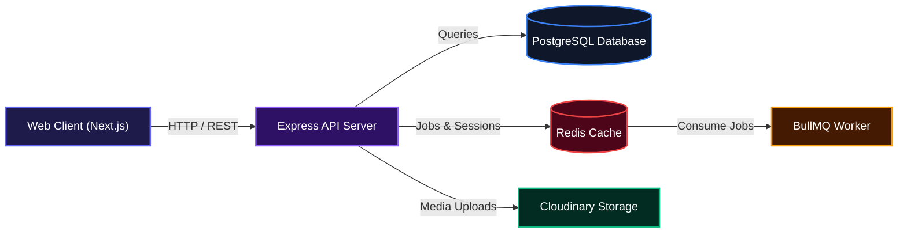
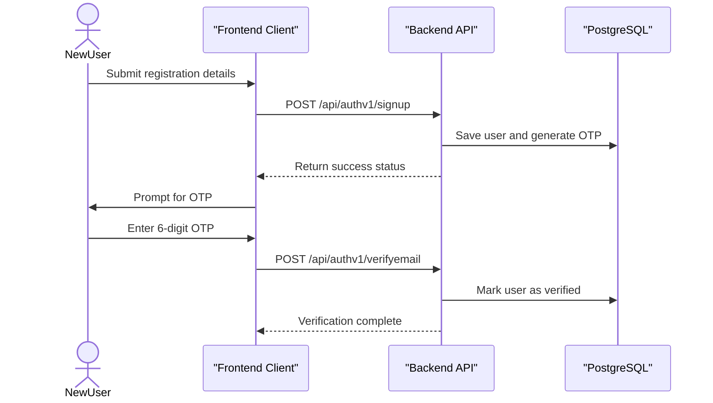
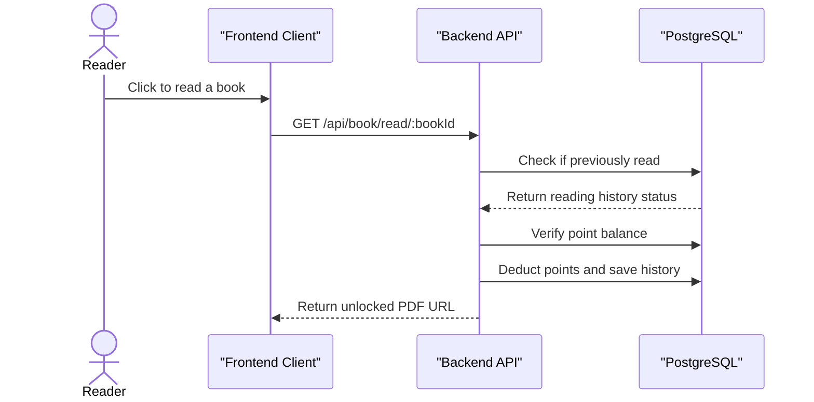

# ReadNest

A comprehensive platform for discovering, unlocking, and enjoying digital books.

## Overview

ReadNest helps users discover and read digital books through a straightforward point-based system. It takes the hassle out of digital library management by giving administrators the tools to upload and organize content while providing readers an intuitive platform to track their reading history and unlock new titles. The system handles everything from automated email verification to seamless PDF processing, allowing teams to focus on delivering great reading experiences without worrying about the underlying infrastructure.

## System Architecture


```mermaid
flowchart LR
  Client["Web Client (Next.js)"]
  API["Express API Server"]
  Database[("PostgreSQL Database")]
  Cache[("Redis Cache")]
  CDN["Cloudinary Storage"]
  Worker["BullMQ Worker"]

  Client -- "HTTP / REST" --> API
  API -- "Queries" --> Database
  API -- "Jobs & Sessions" --> Cache
  API -- "Media Uploads" --> CDN
  Cache -- "Consume Jobs" --> Worker

  style Client fill:#1e1b4b,stroke:#6366f1,stroke-width:2px,color:#fff
  style API fill:#2e1065,stroke:#8b5cf6,stroke-width:2px,color:#fff
  style Database fill:#0f172a,stroke:#3b82f6,stroke-width:2px,color:#fff
  style Cache fill:#4c0519,stroke:#ef4444,stroke-width:2px,color:#fff
  style CDN fill:#022c22,stroke:#10b981,stroke-width:2px,color:#fff
  style Worker fill:#451a03,stroke:#f59e0b,stroke-width:2px,color:#fff
```

## Features

### Authentication and Security

ReadNest secures user accounts through a robust authentication flow. Users register with an email and password, receiving a one-time password via email for verification. The system implements HTTP-only cookies, automatic session refreshing, and account locking mechanisms to prevent unauthorized access.


```mermaid
sequenceDiagram
  actor NewUser
  participant WebClient as "Frontend Client"
  participant APIServer as "Backend API"
  participant DB as "PostgreSQL"

  NewUser->>WebClient: Submit registration details
  WebClient->>APIServer: POST /api/authv1/signup
  APIServer->>DB: Save user and generate OTP
  APIServer-->>WebClient: Return success status
  WebClient->>NewUser: Prompt for OTP
  NewUser->>WebClient: Enter 6-digit OTP
  WebClient->>APIServer: POST /api/authv1/verifyemail
  APIServer->>DB: Mark user as verified
  APIServer-->>WebClient: Verification complete
```

### Point-Based Book Access

The platform operates on a dynamic point system where books cost points based on their total page count. Users receive a sign-up bonus and can manually deposit points. Once a user decides to read a book, the system verifies their balance, deducts the necessary points, and records the title in their reading history for unlimited future access.


```mermaid
sequenceDiagram
  actor Reader
  participant WebClient as "Frontend Client"
  participant APIServer as "Backend API"
  participant DB as "PostgreSQL"

  Reader->>WebClient: Click to read a book
  WebClient->>APIServer: GET /api/book/read/:bookId
  APIServer->>DB: Check if previously read
  DB-->>APIServer: Return reading history status
  APIServer->>DB: Verify point balance
  APIServer->>DB: Deduct points and save history
  APIServer-->>WebClient: Return unlocked PDF URL
```

### Administrative Library Management

Administrators maintain full control over the digital library. The platform provides an interface to upload new books along with cover images. Behind the scenes, the server calculates page counts, uploads media files to secure storage, and triggers background jobs to process the assets without blocking the user interface.

## Installation

Follow these steps to set up the project locally.

Clone the Repository:

```bash
git clone https://github.com/skido600/ReadNest.git
```

Install Server Dependencies:

```bash
cd ReadNest/server
npm install
```

Configure Server Environment Variables:

```bash
PORT=5000
DATABASE_URL=your_neon_postgres_url
ACCESS_TOKEN_SECRET=your_access_secret
REFRESH_TOKEN_SECRET=your_refresh_secret
HMAC_VERIFICATION_CODE_SECRET=your_hmac_secret
FORGETPASSWORD_SEC=your_forgot_secret
EMAIL_USER=your_smtp_email
EMAIL_PASSWORD=your_smtp_password
CLOUDINARY_CLOUD_NAME=your_cloud_name
CLOUDINARY_API_KEY=your_cloudinary_key
CLOUDINARY_API_SECRET=your_cloudinary_secret
```

Push Database Migrations:

```bash
npm run build
npx drizzle-kit push
```

Install Client Dependencies:

```bash
cd ../client
npm install
```

Configure Client Environment Variables:

```bash
NEXT_PUBLIC_BACKEND_URL=http://localhost:5000
```

## Usage

Start the development servers for both the client and the API.

Start the backend API and worker processes:

```bash
cd server
npm run dev
```

Start the frontend Next.js application:

```bash
cd client
npm run dev
```

Open `http://localhost:3000` in your browser. You can create a new account to receive the sign-up bonus points. Check your email for the verification OTP. Once logged in, browse the discovery feed to unlock and read books directly in your browser.

## Technologies Used

| Category | Technology |
|---|---|
| Frontend | [Next.js](https://nextjs.org), [React](https://react.dev), [Tailwind CSS](https://tailwindcss.com) |
| Data Fetching | [TanStack Query](https://tanstack.com/query) |
| PDF Viewer | [React-PDF](https://github.com/wojtekmaj/react-pdf) |
| Backend | [Node.js](https://nodejs.org), [Express](https://expressjs.com) |
| Database | [PostgreSQL](https://www.postgresql.org), [Drizzle ORM](https://orm.drizzle.team) |
| Caching & Queues | [Redis](https://redis.io), [BullMQ](https://docs.bullmq.io) |
| Authentication | [Argon2](https://github.com/ranisalt/argon2), [JSON Web Tokens](https://jwt.io) |
| File Storage | [Cloudinary](https://cloudinary.com) |

## API Documentation

The backend exposes the following RESTful API endpoints. All protected routes require a valid HTTP-only `accessToken` cookie.

### Authentication Endpoints

#### POST /api/authv1/signup
**Description**: Registers a new user account and dispatches an OTP to the provided email address.

**Request**:
```json
{
  "user_name": "johndoe",
  "email": "john@example.com",
  "password": "securepassword123"
}
```

**Response**:
```json
{
  "success": true,
  "statuscode": 201,
  "message": "User registered successfully. Check your email for verification."
}
```

**Errors**:
- 400: Validation failed
- 409: User already exists

#### POST /api/authv1/verifyemail
**Description**: Verifies a user's email address using the received OTP.

**Request**:
```json
{
  "email": "john@example.com",
  "code": "123456"
}
```

**Response**:
```json
{
  "success": true,
  "statuscode": 200,
  "message": "Email verified successfully"
}
```

**Errors**:
- 400: OTP expiry not set
- 401: Invalid verification code
- 404: User not found
- 409: User already verified
- 410: OTP expired

#### POST /api/authv1/login
**Description**: Authenticates a user, issues access and refresh cookies, and returns the user profile.

**Request**:
```json
{
  "email": "john@example.com",
  "password": "securepassword123"
}
```

**Response**:
```json
{
  "success": true,
  "statuscode": 200,
  "message": "Login successful",
  "data": {
    "user_id": "uuid-string",
    "email": "john@example.com",
    "user_name": "johndoe",
    "role": "user"
  }
}
```

**Errors**:
- 400: Invalid email or password
- 403: Email not verified or account locked
- 404: User not found

#### POST /api/authv1/forget-password
**Description**: Initiates the password recovery process by sending an OTP to the user's email.

**Request**:
```json
{
  "email": "john@example.com"
}
```

**Response**:
```json
{
  "success": true,
  "statuscode": 200,
  "message": "Password reset code sent to your email. the code will expire in the next 10mins",
  "data": "john@example.com"
}
```

#### POST /api/authv1/verifycode
**Description**: Validates the password reset OTP and issues a temporary reset token.

**Request**:
```json
{
  "email": "john@example.com",
  "code": "123456"
}
```

**Response**:
```json
{
  "success": true,
  "statuscode": 200,
  "message": "Code verified successfully",
  "data": "jwt.reset.token"
}
```

#### PUT /api/authv1/resetpassword
**Description**: Updates the user's password using the temporary reset token.

**Request**:
```json
{
  "resetToken": "jwt.reset.token",
  "newPassword": "newpassword123",
  "confirmNewpassword": "newpassword123"
}
```

**Response**:
```json
{
  "success": true,
  "statuscode": 200,
  "message": "Password reset successful"
}
```

#### GET /api/authv1/logout
**Description**: Invalidates the current session and clears authentication cookies.

**Response**:
```json
{
  "success": true,
  "statuscode": 200,
  "message": "Logged out successfully"
}
```

### Book Endpoints

#### GET /api/book/all
**Description**: Retrieves a list of all active books in the library. Accepts an optional `?search=` query parameter.

**Response**:
```json
{
  "success": true,
  "statuscode": 200,
  "message": "all books found",
  "data": [
    {
      "id": "uuid-string",
      "title": "Book Title",
      "author": "Author Name",
      "category": "Thriller",
      "coverphoto": "url",
      "pageCount": 350
    }
  ]
}
```

#### GET /api/book/latest
**Description**: Retrieves the 10 most recently added books.

**Response**:
```json
{
  "success": true,
  "statuscode": 200,
  "message": "books found",
  "data": []
}
```

#### GET /api/book/feature
**Description**: Retrieves a single featured book from the library.

**Response**:
```json
{
  "success": true,
  "statuscode": 200,
  "message": "featured Book",
  "data": []
}
```

#### GET /api/book/point
**Description**: Retrieves the authenticated user's current point balance.

**Response**:
```json
{
  "success": true,
  "statuscode": 200,
  "message": "User points fetched successfully",
  "data": {
    "points": 30000
  }
}
```

#### POST /api/book/deposit
**Description**: Adds simulated points to the user's balance for testing purposes.

**Request**:
```json
{
  "amount": 1000
}
```

**Response**:
```json
{
  "success": true,
  "statuscode": 200,
  "message": "Points deposited successfully",
  "data": {
    "deposited": 1000
  }
}
```

#### GET /api/book/history
**Description**: Retrieves the authenticated user's reading history.

**Response**:
```json
{
  "success": true,
  "statuscode": 200,
  "message": "Read history retrieved successfully",
  "data": []
}
```

#### GET /api/book/read/:bookId
**Description**: Evaluates if the user has access to a book. Deducts points if it is a new read, or bypasses deduction if previously read.

**Response**:
```json
{
  "success": true,
  "statuscode": 200,
  "message": "Book ready to read",
  "data": {
    "filePath": "secure-cloudinary-url.pdf"
  }
}
```

**Errors**:
- 403: Not enough points
- 404: Book not found

#### GET /api/book/me
**Description**: Validates the current session and returns basic user data.

**Response**:
```json
{
  "success": true,
  "statuscode": 200,
  "message": "User fetched successfully",
  "data": {
    "id": "uuid-string",
    "user_name": "johndoe",
    "email": "john@example.com",
    "role": "user"
  }
}
```

#### GET /api/book/download/:bookId
**Description**: Proxies a secure PDF download from Cloudinary to the client.

### Admin Endpoints

#### POST /api/admin/upload
**Description**: Processes a multipart form submission containing a new book's metadata, cover image, and PDF file.

#### PUT /api/admin/editbook/:id
**Description**: Updates the text metadata of an existing book.

#### PUT /api/admin/updatebookfile/:id
**Description**: Replaces the PDF file of an existing book.

#### PUT /api/admin/updatebookcover/:id
**Description**: Replaces the cover image of an existing book.

#### DELETE /api/admin/delete/:id
**Description**: Removes a book and its associated media files from storage completely.

### Profile Endpoints

#### PUT /api/profile/change
**Description**: Updates the authenticated user's password.

**Request**:
```json
{
  "oldpassword": "currentpassword",
  "password": "newpassword123"
}
```

#### GET /api/profile/amount
**Description**: Retrieves the raw point transactions history for the authenticated user.

## Contributing

Contributions are always welcome. Feel free to open issues or submit pull requests for new features, bug fixes, or documentation improvements. Please ensure your code follows the existing style and passes all linting rules before opening a pull request.

## Author Info

*   GitHub: [skido600](https://github.com/skido600)

## Badges

[](https://nextjs.org/)
[](https://react.dev/)
[](https://www.typescriptlang.org/)
[](https://nodejs.org/)
[](https://expressjs.com/)
[](https://www.postgresql.org/)
[](https://redis.io/)

[](https://dokugen.samueltuoyo.com)